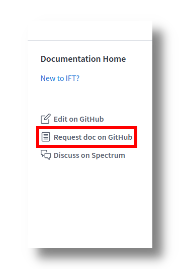
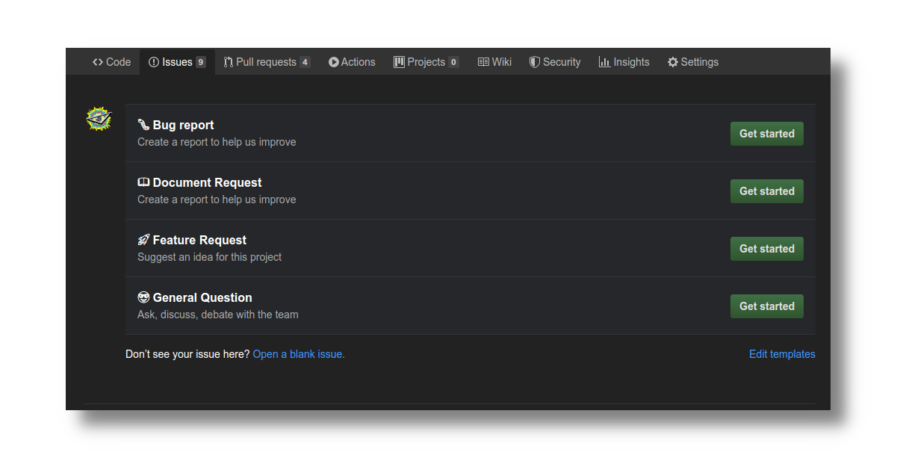
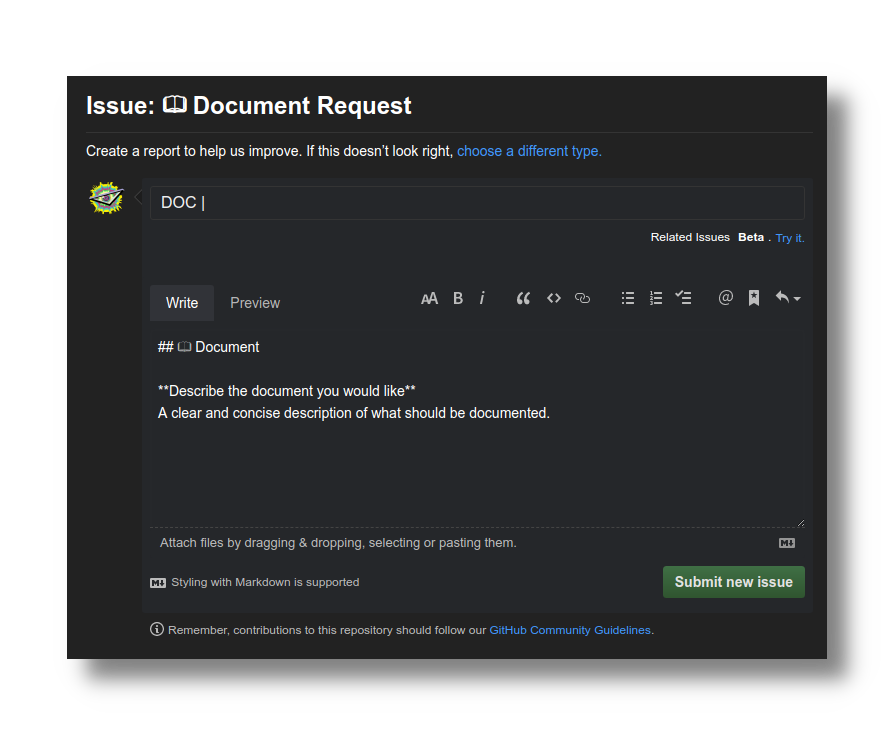

## 0. Search for existing request

Someone might have had the same feedback you are having and had already started a request. To check whether this is the case, please go to the [issue tracker](https://github.com/ift-gftc/doc.ift.org/issues) and search for what you are looking for first. The community would be delighted to have you join the conversation!

If you have determined that your request is unique, there are `two` ways for you to submit your request:

## 1.A. Use the built-in request link

You can submit a new request by simply click on the link that says `Request doc on Github`. This link is positioned on the right sidebar for desktop, and at the bottom footer for mobile:

## 1.B. Use github's new issue button

You can submit a documentation request or a non-documentation request (such as feature, bug report), by using the github issue tracker. You can either access this feature by going to the [documentation's github issue tracker](https://github.com/ift-gftc/doc.ift.org/issues) and click `new issue`, or simply [click here](https://github.com/ift-gftc/doc.ift.org/issues/new/choose).

To start your request, click the `Get started` button on the same column as the `Document Request` section. For other type of request, simply click the button corresponding to their respective row. The information provided for each section should be self-explanatory as to what they are for.

## 2. Fill out the specification

You will be asked on the request template to answer a list of questions. Please be as thorough in your answer as possible, so that we can understand your need. Once you are finished, simply click `Submit new issue`, and you are done!

