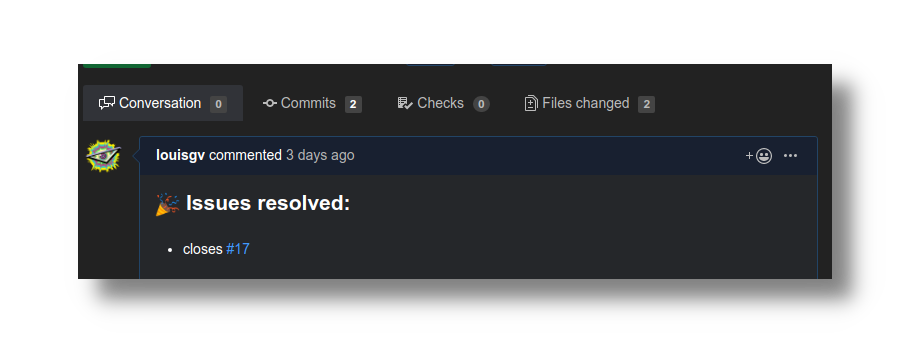

To reduce error and streamline the process of incorporating new changes to this documentation, we use a peer-review workflow called `pull request` (PR). This process, in the context of this documentation, is step-by-step described as follow:

1. User submits a new documentation request ticket
2. Contributor (could be the user above) [work on the new documentation](/contributions/how-to-work-on-doc)
3. Contributor then submit her changes via a `PR`
4. Other users test and either request change or approve the `PR` 
5. The PR is merged into the documentation and the request is `closed`

We use Github to faciliate the workflow above. 

If you editted the documentation following [`method A`](contributions/how-to-work-on-doc/#a-use-the-built-in-github-edit-link), the PR process should be straight forward as Github would automate most of it for you. The only thing you would need to be mindful of is the ticket your PR is solving.

If you followed [`method B`](contributions/how-to-work-on-doc/#b-build-the-documentation-locally), please following the guideline below.

## For contributor

Please describe the problem that your PR solved **using an issue ticket** instead of inside the PR description. This enforce us to focus the review on the work you did, and not the problem itself. If a ticket was not created, simply [create a new one](/contributions/how-to-request-new-doc/#1b-use-githubs-new-issue-button) and `closes` it in your PR like so:

Please avoid solving more than 5 tickets in a single PR. This reduces review time significantly and ensure your change are quickly incorporated into the documentation as soon as possible.

Please name your branch descriptively or use ticket convention (`feat-23`, `bug-32`). This helps reduce confusion for reviewer when reviewing your work.

## For reviewer

Please test the contribution and make sure it can run locally.

Please make sure the PR description is closing at least 1 issue ticket.

Please resist adding your own change to the PR, unless you communicated with the PR owner prior. Use the github review tool to pin-point out the problematic lines, and leave helpful feedback for the contributor to make the necessary changes.

Please avoid bias in your review and instead provide an example or prior art of solving similar problem. This avoid potential personal attack toward the contributor while allowing the contributor to grow and learn from the source.

Please be civil and be as helpful as you can. 